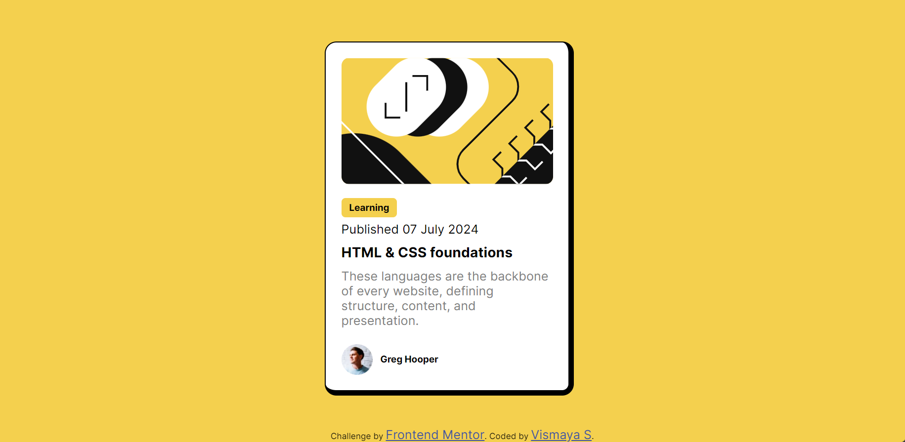

# Frontend Mentor - Blog preview card solution

This is a solution to the [Blog preview card challenge on Frontend Mentor](https://www.frontendmentor.io/challenges/blog-preview-card-ckPaj01IcS). Frontend Mentor challenges help you improve your coding skills by building realistic projects. 

## Table of contents

- [Overview](#overview)
  - [The Challenge](#the-challenge)
  - [Screenshot](#screenshot)
  - [Links](#links)
- [My Process](#my-process)
  - [Built With](#built-with)
  - [What I Learned](#what-i-learned)
- [Author](#author)
- [Acknowledgments](#acknowledgments)

## Overview

### The challenge

Users should be able to:

- See hover and focus states for all interactive elements on the page

### Screenshot

### Links

- Solution URL: https://www.frontendmentor.io/solutions/css-responsive-blog-preview-card-Qz98UKYeaZ
- Live Site URL: https://vismayaskumar.github.io/blog-preview-card/

### Built with

- Semantic HTML5 markup
- CSS custom properties
- Flexbox

### What I Learned

I learned how to make a responsive layout using Flexbox and CSS Grid. Additionally, I practiced using media queries to adapt the design for different screen sizes.

## Author

- Frontend Mentor - [@VismayaSKumar](https://www.frontendmentor.io/profile/VismayaSKumar)
- GitHub - [@VismayaSKumar](https://github.com/VismayaSKumar)

## Acknowledgments

This project was inspired by the Frontend Mentor community. Special thanks to all the mentors and fellow developers who provided feedback and support.
